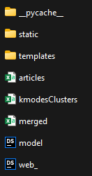
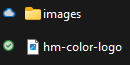

# H&M Personalized Fashion Recommendations 

Actualmente, los consumidores están aumentando la demanda de sistemas personalizados de recomendación de moda, especialmente en el comercio electrónico. La tienda en línea de H&M es una de las familias de marcas y negocios más importantes a nivel mundial, cuando se trata de la industria de la moda, esta cuenta con 53 mercados en línea y aproximadamente 4850 tiendas, las cuales ofrecen a los compradores una amplia selección de productos de ropa para explorar. Sin embargo, con demasiadas opciones, es posible que los clientes no encuentren rápidamente lo que les interesa o lo que buscan y, en última instancia, es posible que no realicen una compra. Por lo tanto, para mejorar la experiencia de compra, las recomendaciones de productos juegan un papel esencial. 

# Estructura del proyecto
No fue posible subir al repositorio todos los archivos necesarios para el despliegue de la aplicación. La estructura del proyecto dentro de la carpeta flaskApp debe quedar de la siguiente manera: 

Los conjuntos de datos utilizados para el despliegue se pueden obtener en los siguientes enlaces:
* [articles](https://drive.google.com/file/d/1G5bQxTFQ62K84A7MhvwHMgT1ER8ljGhS/view?usp=sharing)
* [kmodesClusters](https://drive.google.com/file/d/12X63-cpHJk15K3_-zk0RJpgifbVVAO55/view?usp=sharing)
* [merged](https://drive.google.com/file/d/1bNxkt2aftZNgTvjnj-YHF_754kL9OH7V/view?usp=sharing)

En la carpeta static se encuentra el directorio de imágenes, el cual se puede descargar desde el concurso de Kaggle [H&M Personalized Fashion Recommendations](https://www.kaggle.com/competitions/h-and-m-personalized-fashion-recommendations/data?select=images)

En el siguiente enlace puede encontrar un [resumen del desarrollo del proyecto](https://icesiedu-my.sharepoint.com/:b:/g/personal/1111538056_u_icesi_edu_co/EYJWNfQapBRLgJ31VP5EZo4BBFSSWWV6UaCD3SjCyi5RAg?e=OfG3jP)

# Presentación

